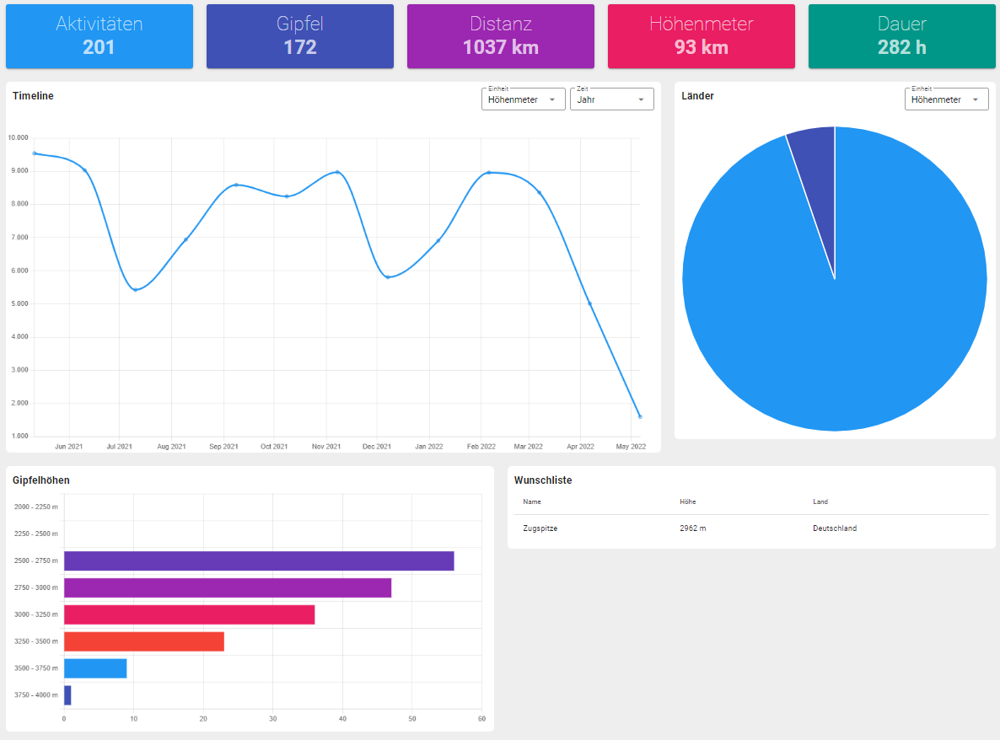
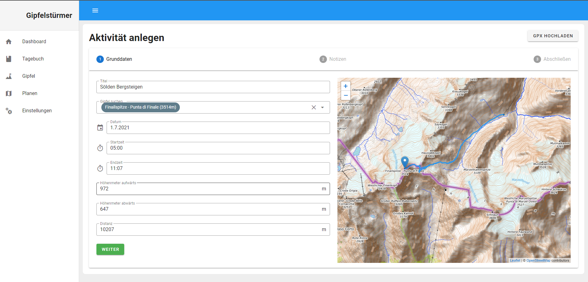
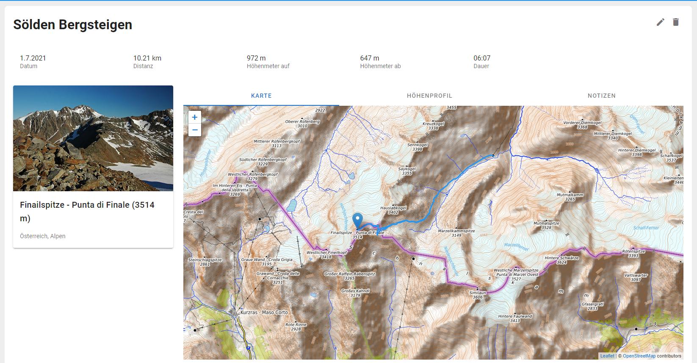
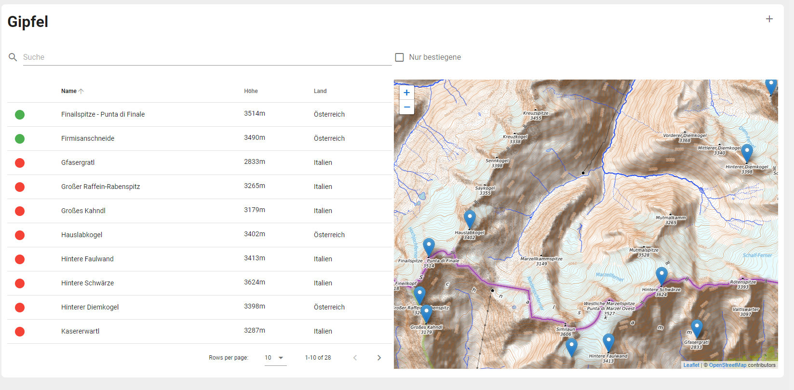

# SummitDiary

Application to organize and visualize hiking tours using

- ASP.NET Core WebAPI
- Vue
- OpenStreetMaps Data

## Features
- Create new activities manually
- Upload your gpx track to analyze
- Display information about all summits
- Put summits on your wishlist
- Get insights with some interesting stats and charts

## Screenshots
### Dashboard

### Create activity

### Activity detail

### Summit detail

### Summit overview

# Notes

All data, that is shown in the app is provided by [OpenStreetMap](https://www.openstreetmap.org/) and it's contributors. The app is meant to be a fun tool and does by no means claim to be correct or valid.